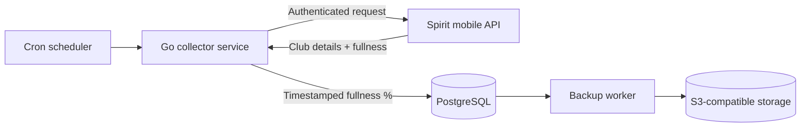

<div align="center">

# SpiritFit Grabber 🏋️‍♂️📈

**A production-minded data collector for Spirit Fitness gym occupancy analytics.**


Collects real-time gym fullness data, stores it as a clean time-series dataset, and prepares the foundation for future occupancy prediction, dashboards, and smart training-time recommendations.

</div>

---

## Why this project exists

Choosing the right time to train should not be guesswork.

**SpiritFit Grabber** periodically collects the current fullness of a selected Spirit Fitness club and saves historical snapshots to PostgreSQL. Over time, this creates a reliable dataset that can be used to predict gym load, discover peak hours, and build user-facing analytics.

This repository is intentionally small, focused, and infrastructure-aware: it is not just a one-off script, but a deployable data collection service with configuration, persistence, graceful shutdown, containerization, and backups.

---

## What it demonstrates

- **Real-world API integration** with authenticated Spirit mobile API requests.
- **Scheduled data collection** using cron expressions with seconds-level support.
- **Persistent time-series storage** in PostgreSQL via GORM.
- **Automatic schema migration** for the collected fullness records.
- **Environment-based configuration** through YAML and custom `!env_str` interpolation.
- **Containerized deployment** with Docker and Docker Compose.
- **Small production image** using a multi-stage Docker build and distroless runtime.
- **Operational safety** with graceful shutdown on `SIGINT` / `SIGTERM`.
- **Automated database backups** to S3-compatible object storage.

---

## Architecture



### Data flow

1. The service loads configuration from `config.yaml`.
2. Environment variables are injected into YAML fields marked with `!env_str`.
3. The app connects to PostgreSQL and applies GORM auto-migrations.
4. It immediately collects one fullness snapshot for the configured club.
5. A cron scheduler continues collecting data at the configured interval.
6. A separate backup container periodically dumps PostgreSQL and uploads the dump to S3-compatible storage.

---

## Core data model

```go
type ClubFullness struct {
    ID        int64     `gorm:"primarykey"`
    Timestamp time.Time `gorm:"index"`
    Fullness  int
}
```

Each record represents one observation:

| Field | Meaning |
| --- | --- |
| `ID` | Auto-generated primary key |
| `Timestamp` | UTC time when the snapshot was collected |
| `Fullness` | Club fullness stored as an integer percentage |

---

## Tech stack

| Layer | Technology |
| --- | --- |
| Language | Go |
| Scheduling | `robfig/cron/v3` |
| Database | PostgreSQL 15 |
| ORM | GORM |
| Configuration | YAML + environment variables |
| Deployment | Docker, Docker Compose |
| Runtime image | Distroless Linux image |
| Backups | `pg_dump` + AWS CLI to S3-compatible storage |

---

## Quick start

### 1. Clone the repository

```bash
git clone https://github.com/mishannn/spiritfit-grabber.git
cd spiritfit-grabber
```

### 2. Create your environment file

```bash
cp .env.example .env
```

Fill in the required variables:

```env
SPIRIT_TOKEN=
SPIRIT_CLUB=
DB_USERNAME=
DB_PASSWORD=
DB_PUBLIC_PORT=5432
S3_BUCKET=
AWS_ACCESS_KEY_ID=
AWS_SECRET_ACCESS_KEY=
```

> Keep `.env` private. It contains API and storage credentials.

### 3. Review collection interval

By default, `config.yaml` collects data every 10 minutes:

```yaml
cron_with_seconds: "0 */10 * * * *"
```

The project uses a cron parser with seconds enabled, so the first field is seconds.

### 4. Run with Docker Compose

```bash
docker compose up --build -d
```

This starts:

- the Go collector service;
- PostgreSQL;
- a PostgreSQL backup worker.

### 5. Check logs

```bash
docker compose logs -f app
```

You should see log lines showing collected and written fullness snapshots.

---

## Running locally without Docker

Install Go and PostgreSQL, export the required environment variables, then run:

```bash
go mod download
go run . -c config.yaml
```

The `-c` flag allows you to pass a custom config path:

```bash
go run . -c ./config.yaml
```

---

## Getting a Spirit token

> Use your own Spirit account and keep the token secret. Do not commit tokens to Git.

Request an SMS code. The phone number should be 10 digits, starting with `9`:

```bash
curl --location 'https://app.spiritfit.ru/Fitness/hs/mobile/login/check' \
  --header 'Content-Type: application/json' \
  --data '{
    "phone": "9000000000"
  }'
```

Use the received code to get an authorization token:

```bash
curl --location 'https://app.spiritfit.ru/Fitness/hs/mobile/login/code' \
  --header 'Content-Type: application/json' \
  --data '{
    "phone": "9000000000",
    "code": "1234"
  }'
```

Use the returned token as `SPIRIT_TOKEN`.

To verify that the token works, request club details:

```bash
curl --location 'https://app.spiritfit.ru/Fitness/hs/mobile/clubs/01' \
  --header 'Authorization: YOUR_TOKEN'
```

---

## Configuration reference

### `config.yaml`

```yaml
spirit:
  token: !env_str "SPIRIT_TOKEN"
  club_id: !env_str "SPIRIT_CLUB"

database:
  address: "postgres"
  port: 5432
  database: "spiritfit"
  username: !env_str "DB_USERNAME"
  password: !env_str "DB_PASSWORD"

cron_with_seconds: "0 */10 * * * *"
```

### Environment variables

| Variable | Required | Description |
| --- | --- | --- |
| `SPIRIT_TOKEN` | Yes | Authorization token for the Spirit mobile API |
| `SPIRIT_CLUB` | Yes | Spirit club ID to collect data for |
| `DB_USERNAME` | Yes | PostgreSQL username |
| `DB_PASSWORD` | Yes | PostgreSQL password |
| `DB_PUBLIC_PORT` | Yes for Compose | Host port exposed for PostgreSQL |
| `S3_BUCKET` | Yes for backups | S3 bucket for database dumps |
| `AWS_ACCESS_KEY_ID` | Yes for backups | Access key for S3-compatible storage |
| `AWS_SECRET_ACCESS_KEY` | Yes for backups | Secret key for S3-compatible storage |

---

## Project structure

```text
.
├── main.go                    # Application lifecycle, scheduler, DB write path
├── spirit.go                  # Spirit API client and response models
├── config.go                  # YAML config loader with env interpolation
├── config.yaml                # Runtime configuration template
├── docker-compose.yaml        # Collector + PostgreSQL + backup worker
├── Dockerfile                 # Multi-stage Go build with distroless runtime
├── .env.example               # Required environment variables
└── postgres-backup/
    ├── Dockerfile             # Backup worker image
    └── entrypoint.sh          # pg_dump loop and S3 upload
```

---

## Operational notes

### Persistence

PostgreSQL data is stored in a named Docker volume:

```yaml
volumes:
  postgres_data:
    driver: local
```

### Backups

The backup worker periodically creates a PostgreSQL dump and uploads it to S3-compatible storage:

```text
dump_spiritfit.sql -> s3://$S3_BUCKET/dump_spiritfit.sql
```

### Shutdown

The app listens for termination signals and stops the scheduler before exiting, making it suitable for containerized environments.
